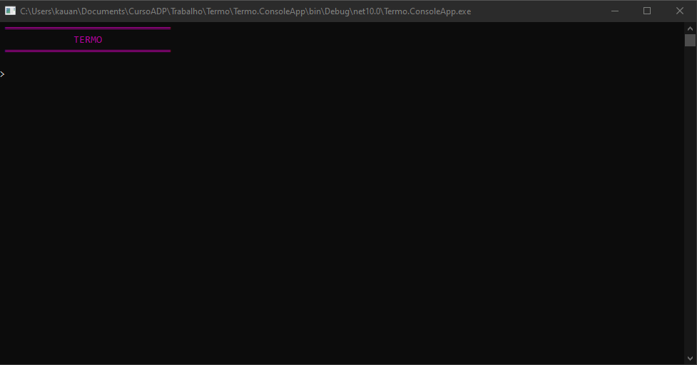
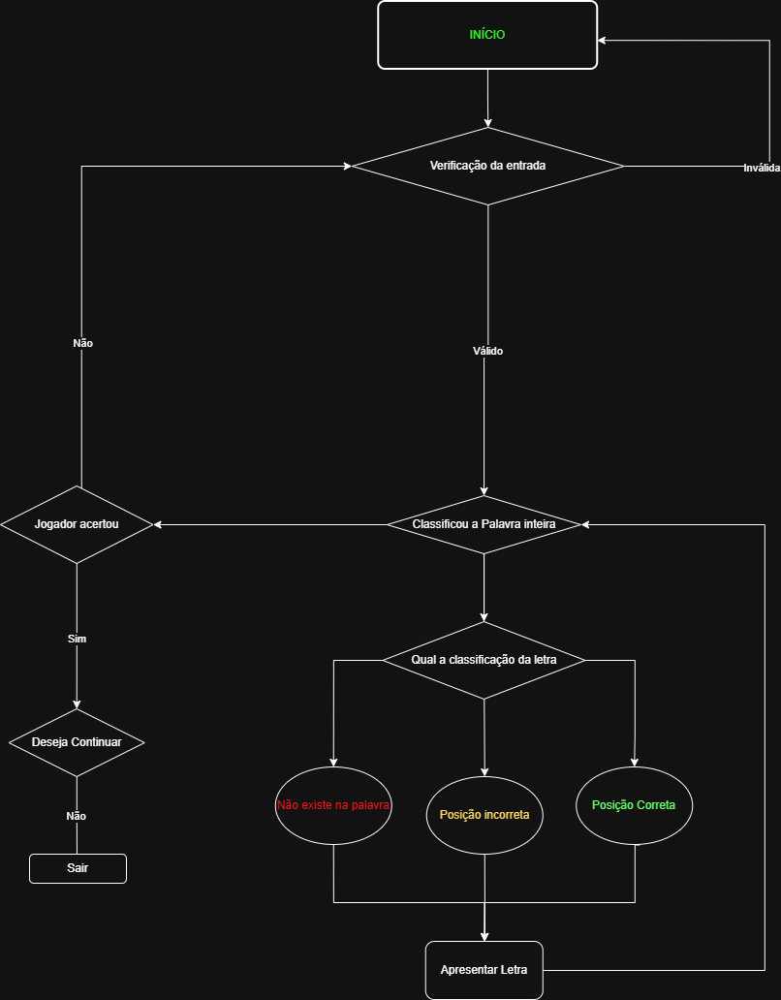

# Termo (Console App)

## Sobre o Projeto
O Termo é um jogo desenvolvido em C# no console, inspirado em jogos de adivinhação de palavras.
O objetivo do jogador é descobrir uma palavra secreta de 5 letras escolhida aleatoriamente pelo sistema.

A cada tentativa, o jogo fornece feedback visual utilizando cores, auxiliando o jogador a encontrar a resposta correta.

## Como Funciona
- O sistema escolhe aleatoriamente uma palavra de 5 letras.
- O jogador possui 5 tentativas para acertar.
- Após cada tentativa, o jogo exibe dicas com cores.

## Feedback das Letras
- Vermelho escuro → Letra não existe na palavra
- Amarelo escuro → Letra existe, mas está na posição errada
- Verde escuro → Letra correta na posição correta

## Condições do Jogo

### Vitória
O jogador vence quando acerta exatamente a palavra sorteada.

### Derrota
O jogador perde quando utiliza todas as tentativas sem acertar a palavra.

## Funcionalidades
- Sorteio aleatório de palavras
- Validação de entrada do usuário
- Sistema de feedback por cores
- Controle de tentativas
- Opção de jogar novamente

## Fluxograma utilizado para comprienção da logica principal

## Tecnologias Utilizadas
- C#
- .NET (Console Application)

## Como Executar
Clone o repositório:
git clone https://github.com/KauanGalvani/termo.git
Abra o projeto no Visual Studio
Execute o programa (F5)

## Autor
Desenvolvido por Kauan Galvani no curso full-stack da Academia Do Programador.